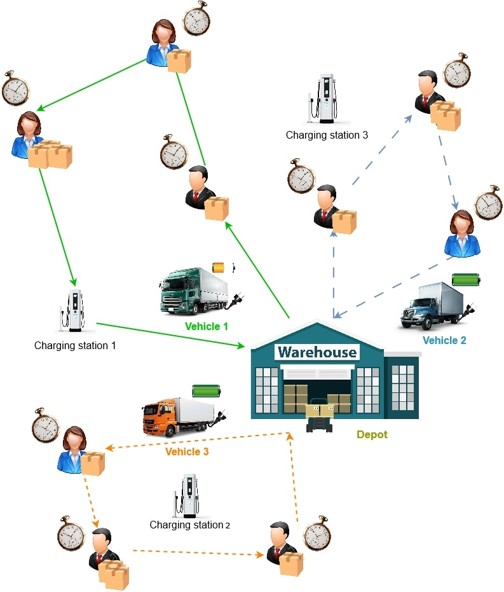

<h1 align="center"><b>Electric Vehicle Routing Problem with Reinforcement Learning</b></h1>

<p align="center">
  
  
  
  
</p>

<p align="center">
  
</p>

<p align="center"><b>This project addresses the challenges faced by fleet managers transitioning from Internal Combustion Engine vehicles to Electric Vehicles (EVs). The Electric Vehicle Routing Problem (EVRP) is solved using a novel Reinforcement Learning approach combined with graph-based modeling, specifically using Structure2vec and Double Deep Q-Network (DDQN).</b></p>

---

## <b>Table of Contents</b>

- [**Project Overview**](#project-overview)
- [**Features**](#features)
- [**Methodology**](#methodology)
- [**Installation**](#installation)
- [**Usage**](#usage)
- [**Experiments**](#experiments)
- [**Contributing**](#contributing)
- [**License**](#license)

---

## <b>Project Overview</b>

This project proposes a Reinforcement Learning-based approach for solving the Electric Vehicle Routing Problem with Time Windows (EVRPTW). The solution optimizes route planning for EV fleets, considering constraints such as charging stations, battery management, and time windows. The model leverages graph embeddings using **Structure2vec** and trains a **Double Deep Q-Network (DDQN)** to minimize travel distance while adhering to customer time windows.

<p align="center">
  
</p>

---

## <b>Features</b>

<table>
<tr>
  <td>✔ Optimization of EV fleet routes with time window constraints</td>
</tr>
<tr>
  <td>✔ Integration of battery state of charge (SoC) and charging station availability</td>
</tr>
<tr>
  <td>✔ Graph embeddings using Structure2vec for network representation</td>
</tr>
<tr>
  <td>✔ Reinforcement Learning-based approach using Double Deep Q-Network (DDQN)</td>
</tr>
<tr>
  <td>✔ Scalable solution for large EV fleets</td>
</tr>
</table>

---

## <b>Methodology</b>

### <b>Graph Embeddings with Structure2vec (S2V)</b>

Graph embeddings encode the EV routing problem into a feature space for reinforcement learning. We use Structure2vec to represent customers, charging stations, and the depot in a graph.

### <b>Reinforcement Learning: Double Deep Q-Network (DDQN)</b>

The decision-making process is modeled as a Markov Decision Process (MDP). The agent learns a policy by maximizing cumulative rewards through Q-learning. The state space includes vertex coordinates, battery state, and vehicle load, while actions include selecting customers or charging stations.

---

## <b>Installation</b>

### Install required Python dependencies:
```bash
pip install -r requirements.txt
```

## Usage

This project is designed to help optimize routes for Electric Vehicles (EVs) using Reinforcement Learning (RL) techniques. Below are examples of how you can use this project:

### Example 1: Train the Model
You can train the model using the provided dataset for Electric Vehicle Routing Problem (EVRP). To do this, run the following command:
```bash
python train_model.py
```


## License

Distributed under the MIT License. See `LICENSE.txt` for more information.

<p align="right">(<a href="#readme-top">back to top</a>)</p>


<!-- CONTRIBUTING -->
## Contributing
Contributions are welcome and appreciated! To contribute:

1. **Fork the repository**: Click on the "Fork" button on the repository's page to create a copy of the repository in your own GitHub account.
2. **Clone your forked repository** to your local machine:
    ```bash
    git clone https://github.com/your-username/EV-Routing-Problem.git
    cd EV-Routing-Problem
    ```
3. **Create a new branch** for your feature or bugfix:
    ```bash
    git checkout -b feature-branch
    ```
4. **Make your changes** in your preferred code editor.
5. **Commit your changes** with a descriptive message:
    ```bash
    git commit -m "Added a new feature"
    ```
6. **Push your changes** to your GitHub repository:
    ```bash
    git push origin feature-branch
    ```
7. **Open a Pull Request**: Go to your repository on GitHub, and click on "New Pull Request" to submit your changes for review.

