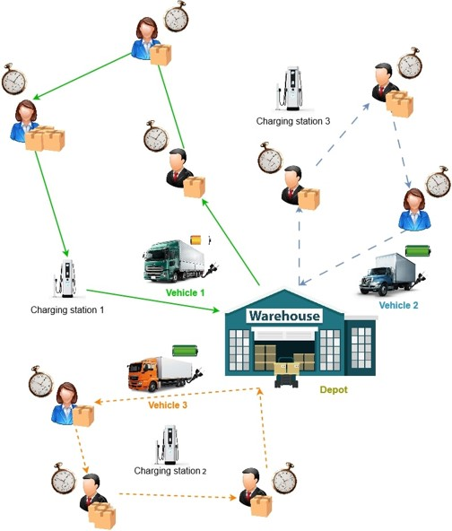

<h1 align="center"><b>Electric Vehicle Routing Problem with Reinforcement Learning</b></h1>

<p align="center">
  
  
  
  
</p>

<p align="center">
  
</p>

<p align="center"><b>This project addresses the challenges faced by fleet managers transitioning from Internal Combustion Engine vehicles to Electric Vehicles (EVs). The Electric Vehicle Routing Problem (EVRP) is solved using a novel Reinforcement Learning approach combined with graph-based modeling, specifically using Structure2vec and Double Deep Q-Network (DDQN).</b></p>

---

## <b>Table of Contents</b>

- [**Project Overview**](#project-overview)
- [**Features**](#features)
- [**Methodology**](#methodology)
- [**Installation**](#installation)
- [**Usage**](#usage)
- [**Experiments**](#experiments)
- [**Contributing**](#contributing)
- [**License**](#license)

---

## <b>Project Overview</b>

This project proposes a Reinforcement Learning-based approach for solving the Electric Vehicle Routing Problem with Time Windows (EVRPTW). The solution optimizes route planning for EV fleets, considering constraints such as charging stations, battery management, and time windows. The model trains a **Deep Q-Network (DQN)** to minimize travel distance while adhering to customer time windows.

---

## <b>Features</b>

<table>
<tr>
  <td>✔ Optimization of EV fleet routes with time window constraints</td>
</tr>
<tr>
  <td>✔ Integration of battery state of charge (SoC) and charging station availability</td>
</tr>
<tr>
  <td>✔ Reinforcement Learning-based approach using Deep Q-Network (DQN)</td>
</tr>
<tr>
  <td>✔ Scalable solution for large EV fleets</td>
</tr>
</table>

---

## <b>Installation</b>

### Install required Python dependencies:
```bash
pip install -r requirements.txt
```

## <b>Usage</b>

This project is designed to help optimize routes for Electric Vehicles (EVs) using Reinforcement Learning (RL) techniques. Below are examples of how you can use this project:

### Example 1: Test the Model
You can test the model using the provided dataset for Electric Vehicle Routing Problem (EVRP). To do this, run the jupyter notebook file:
```bash
jupyter notebook evrp.ipynb
```

## <b>License</b>

Distributed under the MIT License. See `LICENSE.txt` for more information.

<p align="right">(<a href="#readme-top">back to top</a>)</p>
